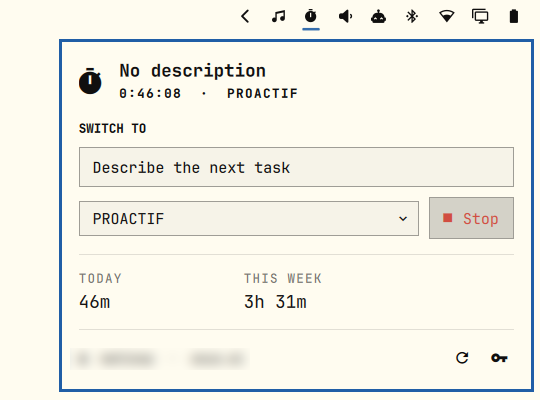

# Clockify for Omarchy

This fork of [matyssxdxd/clockify](https://github.com/matyssxdxd/clockify)
hardens local API-key storage, concurrent updates, network retries, and handling
of text received from Clockify.

A [Clockify](https://clockify.me) timer in the Omarchy bar. The pill is one
glyph -- bold while a timer runs -- and the panel starts and stops it, picks a
project, and totals the day and the week.

```
󱎫   ← bar pill: bold while timing, dimmed when no timer runs
```

Hover it for the running task, its elapsed time, and today's total.



## Install

```sh
omarchy plugin add https://github.com/nibra180/io.github.nibra180.clockify.git --enable
```

Or, while developing it locally, drop the folder in
`~/.config/omarchy/plugins/io.github.nibra180.clockify/` and enable it:

```sh
omarchy plugin validate ~/.config/omarchy/plugins/io.github.nibra180.clockify
omarchy plugin enable io.github.nibra180.clockify
```

Needs `python3` (Omarchy ships it) and nothing else.

## Connect

Click the pill, paste your API key, press Connect. The key comes from Clockify →
**Preferences → Advanced → API**.

It is stored in `~/.config/omarchy/clockify.json` with mode `0600`, and the
plugin validates it against Clockify before writing it. `$CLOCKIFY_API_KEY`
takes precedence when set, so a key you already manage elsewhere (a password
manager, an `age`-encrypted env file) needs no copy on disk. The panel sends API
keys and task descriptions to the helper over stdin, not command-line arguments,
so they do not show up in `ps` for other users.

The trailing key button in the panel footer forgets a stored key. It cannot
remove a key supplied through `$CLOCKIFY_API_KEY`.

## Use

| Action | Mouse | Keyboard (panel open) |
| --- | --- | --- |
| Open/close the panel | Left-click the pill | `Esc` closes |
| Start / stop the timer | Right-click the pill, or **Start**/**Stop** | `s` |
| Refresh from Clockify | Middle-click the pill, or the footer ↻ | `r` |
| Describe the next task | Click the text field | `d`, then `Enter` to start timing it |
| Pick a project | Click the dropdown | `p` |
| Move the cursor | Hover | `j` / `k` or arrows |
| Activate the cursor row | Click | `Enter` |
| Switch to the neighbouring bar panel | — | `Tab` / `Shift+Tab` |

Starting a timer while one runs switches: the old entry is stopped at that
instant and the new one begins, the same as Clockify's own web UI. The selected
project is remembered as the default for the next start. If the workspace
requires projects, the plugin asks for one before starting instead of creating
a timer that Clockify later refuses to stop.

Descriptions that begin with a ticket number are remembered from recent entries.
Type `#42` to see earlier `#42 ...` descriptions. Pick one with the mouse or the
arrow keys and `Enter`; the plugin fills in its description and active project.
Press `Enter` again to start the timer.

**Today** and **This week** count closed entries plus the live elapsed time of
the running one, so they keep moving between refreshes. The week starts on
Monday; set `"weekStart": "sunday"` in `~/.config/omarchy/clockify.json` for the
other convention.

## Configure

Widget settings live on the bar entry (edit them in the bar settings panel, or
in `~/.config/omarchy/shell.json` under the widget's entry):

| Setting | Default | Meaning |
| --- | --- | --- |
| `refreshIntervalSec` | 60 | How often the bar re-reads Clockify |
| `hideWhenIdle` | false | Hide the pill when no timer runs (it still appears while unconnected) |

Move the widget:

```sh
omarchy bar move io.github.nibra180.clockify --section center
```

## Shell commands

```sh
omarchy-shell shell summon io.github.nibra180.clockify '{}'   # open the panel
omarchy-shell shell hide io.github.nibra180.clockify
omarchy-shell io.github.nibra180.clockify toggleTimer
omarchy-shell io.github.nibra180.clockify startTimer "Writing docs" ""
omarchy-shell io.github.nibra180.clockify stopTimer
omarchy-shell io.github.nibra180.clockify status                # one-line summary
omarchy-shell io.github.nibra180.clockify debug                 # JSON state of one widget
```

`status`/`debug` answer from whichever monitor's widget owns the IPC target —
`debug` names that screen, and reports the last fetch time and error, which is
the first thing to look at when the pill disagrees with Clockify.

## How it works

| File | Role |
| --- | --- |
| `manifest.json` | `bar-widget` plugin, entry point `Panel.qml`, settings schema |
| `Panel.qml` | Bar glyph, popup, keyboard cursor, IPC surface |
| `Service.qml` | State, refresh timers, and the only caller of the helper |
| `Model.js` | Payload parsing and every string the UI renders |
| `clockify.py` | The whole REST conversation, one JSON object per run |
| `test/test_clockify.py` | Offline tests for the helper's date and payload logic |

The QML never speaks HTTP. `clockify.py` makes the three or four calls a refresh
needs and prints one snapshot, so the panel has a single shape to bind to and a
single place (`error`) to read failures from. It exits 0 even when Clockify
refuses, because a non-zero exit would only tell the shell that *something*
broke.

Two details worth knowing if you hack on it:

- **Per-monitor instances.** A bar exists per screen, so this widget — and its
  service — exists per screen. Their first refreshes are jittered so a shell
  start does not open every connection at once.
- **Address failover.** `api.clockify.me` resolves to several CloudFront
  addresses, and on some networks one of them accepts the connection and then
  answers nothing, which looks exactly like an outage every other refresh. The
  helper resolves the host itself, moves to the next address when one stops
  answering, reuses the connection that worked, and remembers it in
  `clockify.json` as `apiHost` so the next refresh starts there. Delete that
  field if Clockify's addresses ever change under you; it is re-learned.

Run the helper directly while developing:

```sh
./clockify.py status --projects | jq
./clockify.py start --description "Writing docs" --project <project-id>
./clockify.py stop
python3 -m unittest discover -s test
```

After editing any file the shell reloads the plugin on its own; a stale IPC
handler can survive a few reloads, so `omarchy-restart-shell` is the honest way
to check a change.

## Publishing

The id is namespaced to match the repository, so it needs no rename before
publishing. To list it on [omarchyplugins.com](https://omarchyplugins.com):

1. Push this folder to a public GitHub repo, `manifest.json` at its root.
2. `omarchy plugin validate .` — the marketplace runs the same check against
   whichever commit you submit.
3. File the submission issue form linked from
   [omarchyplugins.com/publish.html](https://omarchyplugins.com/publish.html),
   with the repo link, a category, and tags.

The marketplace validates listings, not security. Plugins run unsandboxed, so
review upstream changes before merging them into this fork.

## Remove

```sh
omarchy plugin disable io.github.nibra180.clockify   # keep it installed, off the bar
omarchy plugin remove io.github.nibra180.clockify    # and delete the folder
rm ~/.config/omarchy/clockify.json       # and forget the API key
```

MIT licensed.
